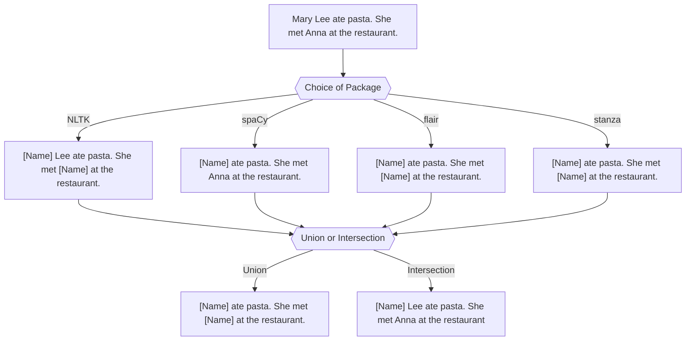
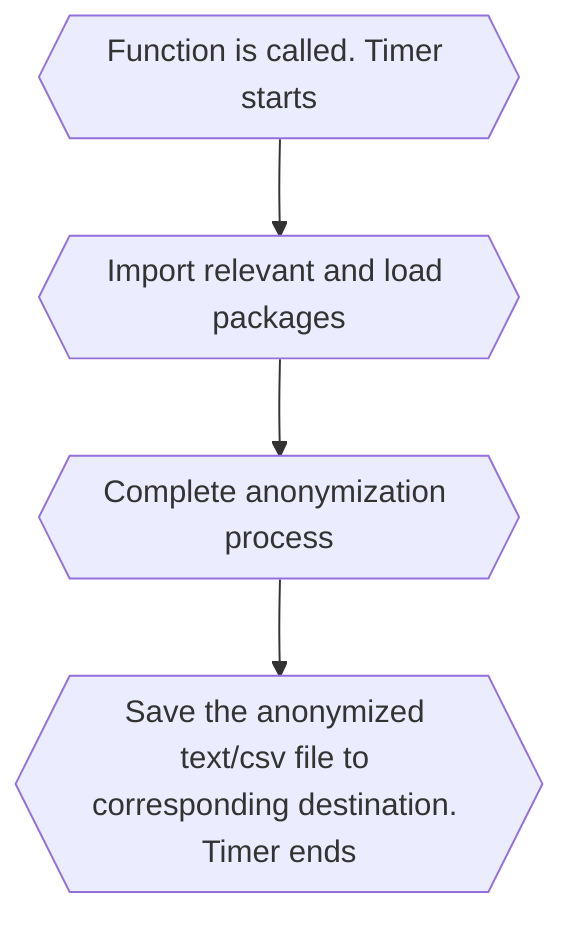

# Anonymisation Tool 

An anonymisation tool which utilises NER packages such as flair, NLTK,spaCy and stanza to mask personal names (default). Other information such as NRIC, phone number etc can also be masked by giving corresponding input.

# Table of Contents
1. [Data](#Data)
2. [Packages Involved](#Packages-Involved)
3. [Model Idea](#Model-Idea)
4. [Evaluation Criteria](#Evaluation-Criteria)
5. [Perfomance](#Performance)
6. [Instructions on Anonymization Tool](#Instructions-on-Anonymization-Tool)


## Data

The tool was evaluated based on a self-modified version of the WikiNeural data that can be found [here](https://github.com/Babelscape/wikineural)

Citation for dataset: 

``` 
Tedeschi, S., Maiorca, V., Campolungo, N., Cecconi, F., & Navigli, R. (2021). 
WikiNEuRal: Combined Neural and Knowledge-based Silver Data Creation for Multilingual NER.
In Findings of the Association for Computational Linguistics: EMNLP 2021 (pp. 2521–2533). 
Association for Computational Linguistics.
```

<details><summary>Preview of Raw Dataset </summary>
<p>


</p>
</details>

<details><summary>Preview of Modified Dataset </summary>
<p>

| Sentence                                                                                                                                  | Expected Output                                                                                                                          |
| ----------------------------------------------------------------------------------------------------------------------------------------- | ------------------------------------------------------------------------------------------------------------------------------- |
|  Since then , only Terry Bradshaw in 147 games , Joe Montana in 139 games , and Tom Brady in 131 games have reached 100 wins more quickly |  Since then , only \[Name\] in 147 games , \[Name\] in 139 games , and \[Name\] in 131 games have reached 100 wins more quickly |
|  He was portrayed by Anthony Perkins in the 1960 version of Psycho directed by Alfred Hitchcock and the Psycho franchise                  |  He was portrayed by \[Name\] in the 1960 version of Psycho directed by \[Name\] and the Psycho franchise                       |

</p>
</details>

As the main purpose of my anonymization tool is to mask personal names, sentences that do not contain personal names were removed. Due to the long run time required by packages like flair, only 1000 sentences were used for the final evaluation. 

### Final Data Distribution 

The 1000 sentences used for the final evaluation can contain varying number of words, ranging from 3 words to 112 words. Most of the sentences contain around 13 to 23 words


In addition, most of the sentences used in the final evaluation contain only 1 personal name(Identified by [Name] in the expected output). There is 1 sentence with 16 personal names. 


| Sentence with 16 Personal Names                                                                                                                                  | Expected Output                                                                                                                          |
| ----------------------------------------------------------------------------------------------------------------------------------------- | ------------------------------------------------------------------------------------------------------------------------------- |
| Croatia has been the home of many famous inventors, including Fausto Veranzio, Giovanni Luppis, Slavoljub Eduard Penkala, Franjo Hanaman, and Nikola Tesla, as well as scientists, such as Franciscus Patricius, Nikola Nalješković, Nikola Vitov Gučetić, Josip Franjo Domin, Marino Ghetaldi, Roger Joseph Boscovich, Andrija Mohorovičić, Ivan Supek, Ivan Đikić, Miroslav Radman and Marin Soljačić.  | Croatia has been the home of many famous inventors , including [Name] , [Name] , [Name] , [Name] , and [Name] , as well as scientists , such as [Name] , [Name] , [Name] , [Name] , [Name] , [Name] , [Name] , [Name] , [Name] , [Name] and [Name] |

## Packages Involved 

### General 

- import pandas as pd (to read csv file)
- from operator import itemgetter
- from itertools import groupby
- import re

### NLTK 

This is an open source Python library for Natural Language Processing. 

Citation for NLTK package:

```
Steven Bird, Ewan Klein, and Edward Loper (2009). Natural Language Processing with Python. O’Reilly Media Inc. 
```

For more information regarding the NLTK package, its documentation can be found [here](https://www.nltk.org/)

To use the package, run the following line in your command prompt/terminal:

```
pip install nltk
```

If there is an error stating that items are not found, you can attempt running the following code chunk in a Python interactive interpreter:

```
import nltk
nltk.download('punkt')
nltk.download('averaged_perceptron_tagger')
nltk.download('maxent_ne_chunker')
nltk.download('words')
```
Additional packages required: pandas

### spaCy 

spaCy is a library for advanced Natural Language Processing in Python. 

Citation for spaCy package:

```
cff-version: 1.2.0
preferred-citation:
  type: article
  message: "If you use spaCy, please cite it as below."
  authors:
  - family-names: "Honnibal"
    given-names: "Matthew"
  - family-names: "Montani"
    given-names: "Ines"
  - family-names: "Van Landeghem"
    given-names: "Sofie"
  - family-names: "Boyd"
    given-names: "Adriane"
  title: "spaCy: Industrial-strength Natural Language Processing in Python"
  doi: "10.5281/zenodo.1212303"
  year: 2020

```

For more information regarding the spaCy package, you can either visit their [web page](https://spacy.io/) or their [GitHub page](https://github.com/explosion/spaCy)


To use the package, run the following line in your command prompt/terminal:

```
pip install spacy
```
To download the model, run the following line in your command prompt/terminal:

```
python -m spacy download en_core_web_sm
```
Additional packages required: NA

### flair 

flair is a framework for state-of-the-art Natural Language Processing.

Citation for flair package:

```
@inproceedings{akbik2019flair,
  title={{FLAIR}: An easy-to-use framework for state-of-the-art {NLP}},
  author={Akbik, Alan and Bergmann, Tanja and Blythe, Duncan and Rasul, Kashif and Schweter, Stefan and Vollgraf, Roland},
  booktitle={{NAACL} 2019, 2019 Annual Conference of the North American Chapter of the Association for Computational Linguistics (Demonstrations)},
  pages={54--59},
  year={2019}
}
```

For more information regarding the NLTK package, its GitHub page can be found [here](https://github.com/flairNLP/flair)

To use the package, run the following line in your command prompt/terminal:

```
pip install flair 
```
Additonal packages required: spacy and en_core_wed_sm (Used under flair's use_tokenizer argument)

### stanza 

Stanza is a Python natural language analysis package.

Citation for stanza package:

```
Peng Qi, Yuhao Zhang, Yuhui Zhang, Jason Bolton and Christopher D. Manning. 2020. 
Stanza: A Python Natural Language Processing Toolkit for Many Human Languages. 
In Association for Computational Linguistics (ACL) System Demonstrations. 2020. 
```
Article can be found [here](https://arxiv.org/abs/2003.07082)
To download its paper in pdf format directly, click [here](https://nlp.stanford.edu/pubs/qi2020stanza.pdf)

More information on the framework or citations can be found [here](https://stanfordnlp.github.io/stanza/index.html)

To use the package, run the following line in your command prompt/terminal:

```
pip install stanza
```

In addition, you will need to run the following lines in a Python interactive interpreter:

```
import stanza
stanza.download('en')
```
Additional packages required: NA

### Union and Intersection of Packages 

In the tool, users can either use any of the packages mentioned above or choose to have an intersection/union among the packages. 



## Model Idea 


## Evaluation Criteria

### Recall and Precision 

$$ Recall = {True\ Positive \over True Positive + False\ Negative } 
          = {Number\ of\ correct\ [Name]\ tag\ by\ package \over Number\ of\ [Name]\ tag\ in\ original\ sentence}  $$

$$ Precision = {True\ Positive \over True\ Positive + False\ Positive }
             = {Number\ of\ correct\ [Name]\ tag\ by\ package \over Number\ of\ [Name]\ tag\ by\ package}  $$

Recall and Precision were calculated for all packages on a sentence level and an overall level. 

For sentence level: Recall and Precision are calculated for each sentence using the formulas above. An average is obtained.

For overall level: 

$$ Overall\ Recall = {Total\ number\ of\ correct\ [Name]\ tag\ by\ package\ over\ 1000\ sentences \over Total\ number\ of\ [Name]\ tag\ in\ original\ 1000\ sentence}  $$

$$ Overall\ Precision = {Total\ number\ of\ correct\ [Name]\ tag\ by\ package\ over\ 1000\ sentences \over Total\ number\ of\ [Name]\ tag\ by\ package\ over\ 1000\ sentences}  $$

### Speed

The time package is used to compute the time taken for the anonymization process to be complete. The process is defined as shown in the diagram below:
             


### Memory Blocks 

The tracemalloc package is used to compare the allocated memory of the program. The peak size of the memory block traced by the module during the anonymization process will be compared.

## Performance 

|                                   |     NLTK     |     spaCy    |     flair    |     stanza    |     Union    |     Intersection    |
|-----------------------------------|--------------|--------------|--------------|---------------|--------------|---------------------|
|     Precision (Sentence Level)    |     0.848    |     0.876    |     0.966    |     0.938     |     0.864    |     0.891           |
|     Precision (Overall Level)     |     0.800    |     0.845    |     0.947    |     0.913     |     0.806    |     0.865           |
|     Recall (Sentence Level)       |     0.698    |     0.623    |     0.856    |     0.857     |     0.874    |     0.531           |
|     Recall (Overall Level)        |     0.698    |     0.624    |     0.867    |     0.868     |     0.878    |     0.526           |

(Results may vary if different models or pipelines were used)

|     Package Involved    |     Time Taken (s)    |     Peak Memory Block (MB)    |
|-------------------------|-----------------------|-------------------------------|
|     NLTK                |     55                |     0.742                     |
|     spaCy               |     22                |     53                        |
|     flair               |     751               |     971                       |
|     stanza              |     693               |     212                       |
|     union               |     1554              |     971                       |
|    intersection         |     1600              |     971                       |

(Exact values may vary. Current results are obtained on a MacBook Air M1 Processor)

Note: A while loop is used under NLTK to obtain the start and end character index of the names identified. For spaCy, flair and stanza, these information could be obtained directly from the entities that the package has labelled.  

## Instructions on Anonymization Tool

If you would like to anonymize a single manual input, use [anonymize_manual_input.py](/anonymize_manual_input.py)

If you would like to anonymize a txt file or csv file, use [anonymize_file_input.py](/anonymize_file_input)
- anonymize_manual_input is a nested function in anonymize_file_input, where the former is used to anonymize each line/row in the file input 

```
anonymize_manual_input(user_input,package=['stanza'],union_intersection=None,additional_details=None,additional_expression=None)
```

### Paramters

- user_input: str , required 
  - Item that user would like to anonymize 
    - For anonymize_manual_input, string containing content user would like to mask
    - For anonymize_file_input, string containing file name with file extension 
  
- package: list, optional, default 'stanza'
  - List of strings representing package(s) users would like to use. To be typed in lowercase
  
- union_intersection: str, optional, default None 
  - Only relevant if length of package is more than one 
  - If length of package is more than one, an input is required 
 
- additional_details: list, optional, default None 
  - List of integers representing additional details users would like to mask 
    1) NRIC
    2) Phone Number 
    3) ID 
    4) Case Number 
    5) Date
    6) Admission Time 
    7) Ward Number 
    8) Bed Number
    9) Patient Class
  
- additional_expression: list of nested lists, optional, default None 
  - A list containing nested lists of length 2, containing a regular expression string and a string to replace identified text
  - Eg [[r"(\d{8})","[Phone]"],[r"(\d{3})","[Hundred]"]]
 
Sample text file to anonymize: 

```
anonymize_file_input('sample_discharge_summary.txt', ['flair','stanza'], union_intersection='union', additional_details=[1,2,5])
```

Output saved as [Original File Name]\_anonymized\_.txt in same directory: 

  
