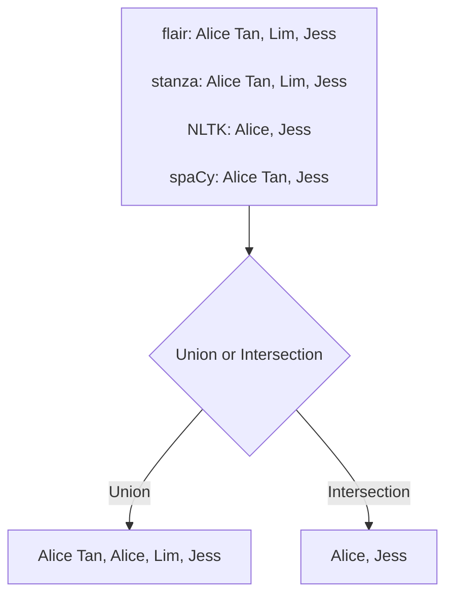
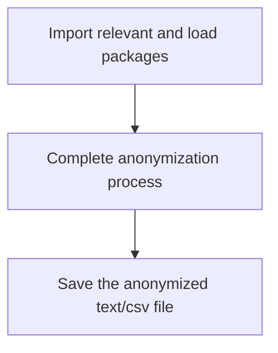

# Anonymisation Tool 

An anonymisation tool which utilises NER packages such as flair, NLTK,spaCy and stanza to mask personal names (default). Other information such as NRIC, phone number etc can also be masked by giving corresponding input.

## Data

The tool was evaluated based on a self-modified version of the WikiNeural data that can be found [here](https://github.com/Babelscape/wikineural)

Citation for dataset: 

``` 
Tedeschi, S., Maiorca, V., Campolungo, N., Cecconi, F., & Navigli, R. (2021). 
WikiNEuRal: Combined Neural and Knowledge-based Silver Data Creation for Multilingual NER.
In Findings of the Association for Computational Linguistics: EMNLP 2021 (pp. 2521–2533). 
Association for Computational Linguistics.
```

<details><summary>Preview of Raw Dataset </summary>
<p>


</p>
</details>

<details><summary>Preview of Modified Dataset </summary>
<p>

| Sentence                                                                                                                                  | Expected Output                                                                                                                          |
| ----------------------------------------------------------------------------------------------------------------------------------------- | ------------------------------------------------------------------------------------------------------------------------------- |
|  Since then , only Terry Bradshaw in 147 games , Joe Montana in 139 games , and Tom Brady in 131 games have reached 100 wins more quickly |  Since then , only \[Name\] in 147 games , \[Name\] in 139 games , and \[Name\] in 131 games have reached 100 wins more quickly |
|  He was portrayed by Anthony Perkins in the 1960 version of Psycho directed by Alfred Hitchcock and the Psycho franchise                  |  He was portrayed by \[Name\] in the 1960 version of Psycho directed by \[Name\] and the Psycho franchise                       |

</p>
</details>

As the main purpose of my anonymization tool is to mask personal names, sentences that do not contain personal names were removed. Due to the long run time required by packages like flair, only 1000 sentences were used for the final evaluation. 

## Final Data Distribution 

The 1000 sentences used for the final evaluation can contain varying number of words, ranging from 3 words to 112 words. Most of the sentences contain around 13 to 23 words


In addition, most of the sentences used in the final evaluation contain only 1 personal name(Identified by [Name] in the expected output). There is 1 sentence with 16 personal names. 


| Sentence with 16 Personal Names                                                                                                                                  | Expected Output                                                                                                                          |
| ----------------------------------------------------------------------------------------------------------------------------------------- | ------------------------------------------------------------------------------------------------------------------------------- |
| Croatia has been the home of many famous inventors , including Fausto Veranzio , Giovanni Luppis , Slavoljub Eduard Penkala , Franjo Hanaman , and Nikola Tesla , as well as scientists , such as Franciscus Patricius , Nikola Nalješković , Nikola Vitov Gučetić , Josip Franjo Domin , Marino Ghetaldi , Roger Joseph Boscovich , Andrija Mohorovičić , Ivan Supek , Ivan Đikić , Miroslav Radman and Marin Soljačić | Croatia has been the home of many famous inventors , including [Name] , [Name] , [Name] , [Name] , and [Name] , as well as scientists , such as [Name] , [Name] , [Name] , [Name] , [Name] , [Name] , [Name] , [Name] , [Name] , [Name] and [Name] |

## Packages Involved 

### NLTK 

This is an open source Python library for Natural Language Processing. 

Citation for NLTK package:

```
Steven Bird, Ewan Klein, and Edward Loper (2009). Natural Language Processing with Python. O’Reilly Media Inc. 
```

For more information regarding the NLTK package, its documentation can be found [here](https://www.nltk.org/)

To use the package, run the following line in your command prompt/terminal:

```
pip install nltk
```

If there is an error stating that items are not found, you can attempt running the following code chunk in a Python interactive interpreter:

```
import nltk
nltk.download('punkt')
nltk.download('averaged_perceptron_tagger')
nltk.download('maxent_ne_chunker')
nltk.download('words')
```
### spaCy 

spaCy is a library for advanced Natural Language Processing in Python. 

Citation for spaCy package:

```
cff-version: 1.2.0
preferred-citation:
  type: article
  message: "If you use spaCy, please cite it as below."
  authors:
  - family-names: "Honnibal"
    given-names: "Matthew"
  - family-names: "Montani"
    given-names: "Ines"
  - family-names: "Van Landeghem"
    given-names: "Sofie"
  - family-names: "Boyd"
    given-names: "Adriane"
  title: "spaCy: Industrial-strength Natural Language Processing in Python"
  doi: "10.5281/zenodo.1212303"
  year: 2020

```

For more information regarding the spaCy package, you can either visit their [web page](https://spacy.io/) or their [GitHub page](https://github.com/explosion/spaCy)


To use the package, run the following line in your command prompt/terminal:

```
pip install spacy
```
To download the model, run the following line in your command prompt/terminal:

```
python -m spacy download en_core_web_sm
```

### flair 

flair is a framework for state-of-the-art Natural Language Processing.

Citation for flair package:

```
@inproceedings{akbik2019flair,
  title={{FLAIR}: An easy-to-use framework for state-of-the-art {NLP}},
  author={Akbik, Alan and Bergmann, Tanja and Blythe, Duncan and Rasul, Kashif and Schweter, Stefan and Vollgraf, Roland},
  booktitle={{NAACL} 2019, 2019 Annual Conference of the North American Chapter of the Association for Computational Linguistics (Demonstrations)},
  pages={54--59},
  year={2019}
}
```

For more information regarding the NLTK package, its GitHub page can be found [here](https://github.com/flairNLP/flair)

To use the package, run the following line in your command prompt/terminal:

```
pip install flair 
```

### stanza 

Stanza is a Python natural language analysis package.

Citation for stanza package:

```
Peng Qi, Yuhao Zhang, Yuhui Zhang, Jason Bolton and Christopher D. Manning. 2020. 
Stanza: A Python Natural Language Processing Toolkit for Many Human Languages. 
In Association for Computational Linguistics (ACL) System Demonstrations. 2020. 
```
Article can be found [here](https://arxiv.org/abs/2003.07082)
To download its paper in pdf format directly, click [here](https://nlp.stanford.edu/pubs/qi2020stanza.pdf)

More information on the framework or citations can be found [here](https://stanfordnlp.github.io/stanza/index.html)

To use the package, run the following line in your command prompt/terminal:

```
pip install stanza
```

In addition, you will need to run the following lines in a Python interactive interpreter:

```
import stanza
stanza.download('en')
```
### Union and Intersection of Packages 

In the tool, users can either use any of the packages mentioned above or choose to have an intersection/union among the packages. 



## Evaluation 

### Recall and Precision 

$$ Recall = {True Positive \over True Positive + False Negative } 
          = {Number\ of\ correct\ [Name]\ tag\ by\ package \over Number\ of\ [Name]\ tag\ in\ original\ sentence}  $$

$$ Precision = {True Positive \over True Positive + False Positive }
             = {Number\ of\ correct\ [Name]\ tag\ by\ package \over Number\ of\ [Name]\ tag\ by\ package}  $$

Recall and Precision were calculated for all packages on a sentence level and an overall level. 

For sentence level: Recall and Precision are calculated for each sentence using the formulas above. An average is obtained.

For overall level: 

$$ Overall\ Recall = {Total\ number\ of\ correct\ [Name]\ tag\ by\ package\ over\ 1000\ sentences \over Total\ number\ of\ [Name]\ tag\ in\ original\ 1000\ sentence}  $$

$$ Overall\ Precision = {Total\ number\ of\ correct\ [Name]\ tag\ by\ package\ over\ 1000\ sentences \over Total\ number\ of\ [Name]\ tag\ by\ package\ over\ 1000\ sentences}  $$

There are cases where the package is able to detect both the first name and last name as names but treated them as two separate names during the masking process. An example is shown below:

| Sentence                                                                                                                                  | Output by tool                                                                                                                          |
| ----------------------------------------------------------------------------------------------------------------------------------------- | ------------------------------------------------------------------------------------------------------------------------------- |
| Joss Whedon was credited as executive producer throughout the run of the series , and for the first five seasons ( 1997 – 2001 ) he was also the showrunner , supervising the writing and all aspects of production |  [Name] [Name] was credited as executive producer throughout the run of the series , and for the first five seasons ( 1997 – 2001 ) he was also the showrunner , supervising the writing and all aspects of production |

Hence, an additional step  was performed in the tool to remove any consecutive [Name] tags, leaving just one single [Name] tag for one name. 


### Speed

The time package is used to compute the time taken for the anonymization process to be complete. The process is defined as shown in the diagram below:
             


### Memory Blocks 

The tracemalloc package is used to compare the allocated memory of the program. The peak size of the memory block traced by the module during the anonymization process will be compared.

## Performance 

|                                   |     NLTK     |     spaCy    |     flair    |     stanza    |     Union    |     Intersection    |
|-----------------------------------|--------------|--------------|--------------|---------------|--------------|---------------------|
|     Precision (Sentence Level)    |     0.846    |     0.875    |     0.959    |     0.937     |     0.859    |     0.888           |
|     Precision (Overall Level)     |     0.796    |     0.844    |     0.944    |     0.911     |     0.787    |     0.861           |
|     Recall (Sentence Level)       |     0.696    |     0.622    |     0.838    |     0.855     |     0.871    |     0.524           |
|     Recall (Overall Level)        |     0.695    |     0.623    |     0.852    |     0.865     |     0.863    |     0.522           |

(Results may vary if different models or pipelines were used)

|     Package Involved    |     Time Taken (s)    |     Peak Memory Block (MB)    |
|-------------------------|-----------------------|-------------------------------|
|     NLTK                |     26                |     116                       |
|     spaCy               |     18                |     102                       |
|     flair               |     702               |     1007                      |
|     stanza              |     592               |     254                       |
|     union               |     1379              |     1007                      |
|    intersection         |     1343              |     1007                      |

(Exact values may vary. Current results are obtained on a MacBook Air M1 Processor)

## Instructions on Anonymization Tool

Besides personal name, the tool is also able to mask other details such as NRIC and phone number. There are three inputs required from the user.

First required input:

```
Besides personal names, the following details may also be masked: 
 1. NRIC 
 2. Phone Number 
 3. ID 
 4. Case Number 
 5. Date 
 6. Admission Time 
 7. Ward Number 
 8. Bed Number 
 9. Patient Class 

For example: Type 125 if you would also like to anonymize NRIC, Phone Number and Date. Type 0 if you do not wish to anonymize any additional details 
 
Which of the following would you like to anonymize?:
```

Second required input:

```
Available packages: flair, spaCy, stanza, nltk. Choose a package:
```

Third required input:

```
Type something or a file name to test the anonymization tool:
```

Please note that this tool only supports csv file, txt files or a single manual input. 

In addition, there is a possibility that the packages may not be able to identify lowercase personal names. For better performance, please perform the anonymization process before any data pre-processing (converting text to lowercase).

<details><summary> Click here for a step by step guide </summary>
<p>
  
Example discharge summary text file modified from mtsamples: 

Step 1: Change directory to where files are stored 

Step 2: Run code file anonymization_tool.py
 
Step 3: Besides personal names, if you would like to anonymize additional details, key in the corresponding numbers. For example, if you would like to also mask NRIC and Phone Number, type ‘12’ and enter
 
Step 4: Choose your package
  
<details><summary> Screenshot of Terminal for Step 1 to 4 </summary>
<p>


</p>
</details>
  
Step 5: When prompted for the third user input, type in file name with its file extension as shown in the screenshot (Refer to last line)
  


The output file will be saved at the same directory with file name being FILENAME_anonymized_.txt, where FILENAME is the name of the original file. 
  


</p>
</details>  
