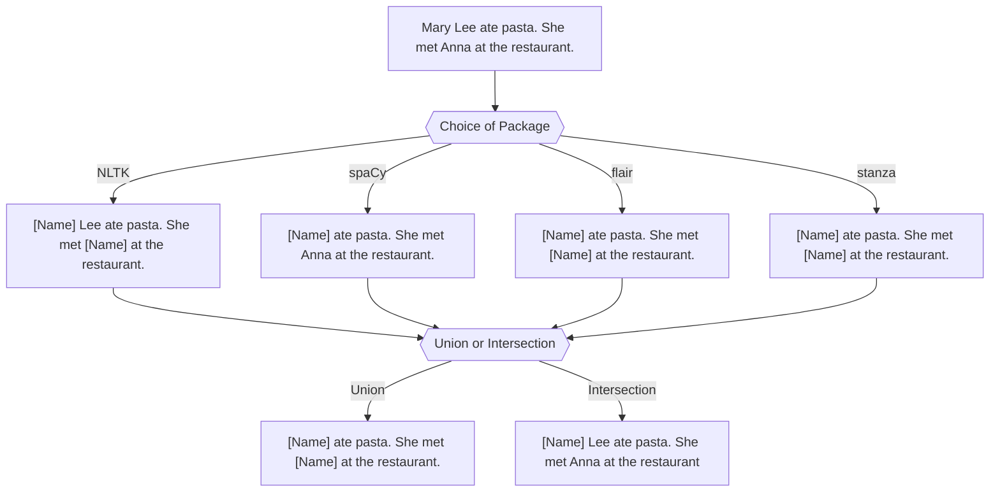
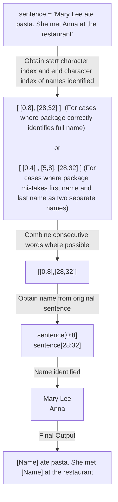
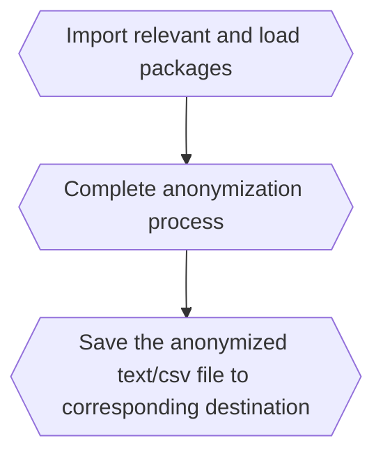
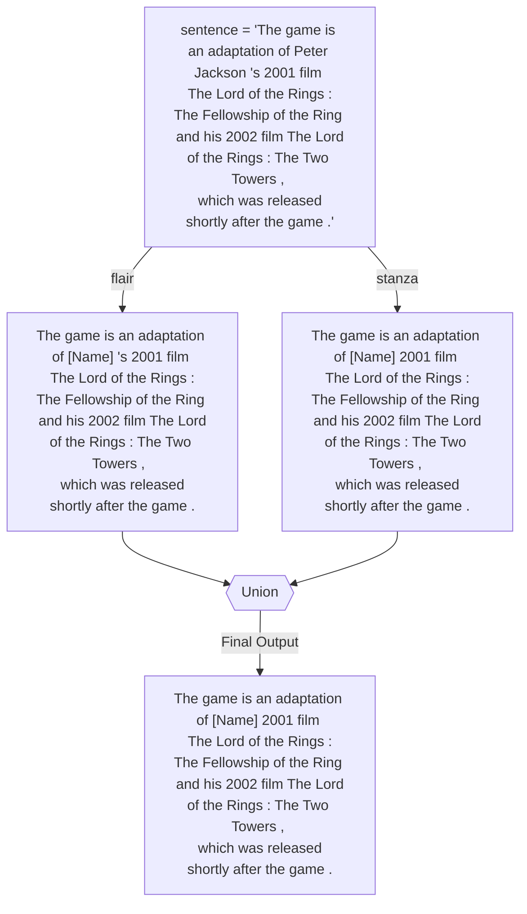

# Anonymisation Tool 

An anonymisation tool which utilises NER packages such as flair, NLTK,spaCy and stanza to mask personal names (default). Other information such as NRIC, phone number etc can also be masked by giving corresponding input.

# Table of Contents
1. [Data](#Data)
2. [Packages Involved](#Packages-Involved)
3. [Model Idea](#Model-Idea)
4. [Evaluation Criteria](#Evaluation-Criteria)
5. [Perfomance](#Performance)
6. [Instructions on Anonymization Tool](#Instructions-on-Anonymization-Tool)


## Data

The tool was evaluated based on a self-modified version of the WikiNeural data that can be found [here](https://github.com/Babelscape/wikineural)

Citation for dataset: 

``` 
Tedeschi, S., Maiorca, V., Campolungo, N., Cecconi, F., & Navigli, R. (2021). 
WikiNEuRal: Combined Neural and Knowledge-based Silver Data Creation for Multilingual NER.
In Findings of the Association for Computational Linguistics: EMNLP 2021 (pp. 2521–2533). 
Association for Computational Linguistics.
```

<details><summary>Preview of Raw Dataset </summary>
<p>


</p>
</details>

<details><summary>Preview of Modified Dataset </summary>
<p>

| Sentence                                                                                                                                  | Expected Output                                                                                                                          |
| ----------------------------------------------------------------------------------------------------------------------------------------- | ------------------------------------------------------------------------------------------------------------------------------- |
|  Since then , only Terry Bradshaw in 147 games , Joe Montana in 139 games , and Tom Brady in 131 games have reached 100 wins more quickly |  Since then , only \[Name\] in 147 games , \[Name\] in 139 games , and \[Name\] in 131 games have reached 100 wins more quickly |
|  He was portrayed by Anthony Perkins in the 1960 version of Psycho directed by Alfred Hitchcock and the Psycho franchise                  |  He was portrayed by \[Name\] in the 1960 version of Psycho directed by \[Name\] and the Psycho franchise                       |

</p>
</details>

As the main purpose of my anonymization tool is to mask personal names, sentences that do not contain personal names were removed. Due to the long run time required by packages like flair, only 1000 sentences were used for the final evaluation. 

### Final Data Distribution 

The 1000 sentences used for the final evaluation can contain varying number of words, ranging from 3 words to 112 words. Most of the sentences contain around 13 to 23 words


In addition, most of the sentences used in the final evaluation contain only 1 personal name(Identified by [Name] in the expected output). There is 1 sentence with 16 personal names. 


| Sentence with 16 Personal Names                                                                                                                                  | Expected Output                                                                                                                          |
| ----------------------------------------------------------------------------------------------------------------------------------------- | ------------------------------------------------------------------------------------------------------------------------------- |
| Croatia has been the home of many famous inventors, including Fausto Veranzio, Giovanni Luppis, Slavoljub Eduard Penkala, Franjo Hanaman, and Nikola Tesla, as well as scientists, such as Franciscus Patricius, Nikola Nalješković, Nikola Vitov Gučetić, Josip Franjo Domin, Marino Ghetaldi, Roger Joseph Boscovich, Andrija Mohorovičić, Ivan Supek, Ivan Đikić, Miroslav Radman and Marin Soljačić.  | Croatia has been the home of many famous inventors , including [Name] , [Name] , [Name] , [Name] , and [Name] , as well as scientists , such as [Name] , [Name] , [Name] , [Name] , [Name] , [Name] , [Name] , [Name] , [Name] , [Name] and [Name] |

## Packages Involved 

### General 

- import pandas as pd (to read csv file)
- from operator import itemgetter
- from itertools import groupby
- import re

### NLTK 

This is an open source Python library for Natural Language Processing. 

Citation for NLTK package:

```
Steven Bird, Ewan Klein, and Edward Loper (2009). Natural Language Processing with Python. O’Reilly Media Inc. 
```

For more information regarding the NLTK package, its documentation can be found [here](https://www.nltk.org/)

To use the package, run the following line in your command prompt/terminal:

```
pip install nltk
```

If there is an error stating that items are not found, you can attempt running the following code chunk in a Python interactive interpreter:

```
import nltk
nltk.download('punkt')
nltk.download('averaged_perceptron_tagger')
nltk.download('maxent_ne_chunker')
nltk.download('words')
```
Additional packages required: pandas

### spaCy 

spaCy is a library for advanced Natural Language Processing in Python. 

Citation for spaCy package:

```
cff-version: 1.2.0
preferred-citation:
  type: article
  message: "If you use spaCy, please cite it as below."
  authors:
  - family-names: "Honnibal"
    given-names: "Matthew"
  - family-names: "Montani"
    given-names: "Ines"
  - family-names: "Van Landeghem"
    given-names: "Sofie"
  - family-names: "Boyd"
    given-names: "Adriane"
  title: "spaCy: Industrial-strength Natural Language Processing in Python"
  doi: "10.5281/zenodo.1212303"
  year: 2020

```

For more information regarding the spaCy package, you can either visit their [web page](https://spacy.io/) or their [GitHub page](https://github.com/explosion/spaCy)


To use the package, run the following line in your command prompt/terminal:

```
pip install spacy
```
To download the model, run the following line in your command prompt/terminal:

```
python -m spacy download en_core_web_sm
```
Additional packages required: NA

### flair 

flair is a framework for state-of-the-art Natural Language Processing.

Citation for flair package:

```
@inproceedings{akbik2019flair,
  title={{FLAIR}: An easy-to-use framework for state-of-the-art {NLP}},
  author={Akbik, Alan and Bergmann, Tanja and Blythe, Duncan and Rasul, Kashif and Schweter, Stefan and Vollgraf, Roland},
  booktitle={{NAACL} 2019, 2019 Annual Conference of the North American Chapter of the Association for Computational Linguistics (Demonstrations)},
  pages={54--59},
  year={2019}
}
```

For more information regarding the NLTK package, its GitHub page can be found [here](https://github.com/flairNLP/flair)

To use the package, run the following line in your command prompt/terminal:

```
pip install flair 
```
Additonal packages required: spacy and en_core_wed_sm (Used under flair's use_tokenizer argument)

```
pip install spacy
```
```
python -m spacy download en_core_web_sm
```

### stanza 

Stanza is a Python natural language analysis package.

Citation for stanza package:

```
Peng Qi, Yuhao Zhang, Yuhui Zhang, Jason Bolton and Christopher D. Manning. 2020. 
Stanza: A Python Natural Language Processing Toolkit for Many Human Languages. 
In Association for Computational Linguistics (ACL) System Demonstrations. 2020. 
```
Article can be found [here](https://arxiv.org/abs/2003.07082)
To download its paper in pdf format directly, click [here](https://nlp.stanford.edu/pubs/qi2020stanza.pdf)

More information on the framework or citations can be found [here](https://stanfordnlp.github.io/stanza/index.html)

To use the package, run the following line in your command prompt/terminal:

```
pip install stanza
```

In addition, you will need to run the following lines in a Python interactive interpreter:

```
import stanza
stanza.download('en')
```
Additional packages required: NA

### Union and Intersection of Packages 

In the tool, users can either use any of the packages mentioned above or choose to have an intersection/union among the packages. 



## Model Idea 



### Use of character index

While it is possible to use the entity text identified as PERSON by the packages directly, character index was used in this implementation to provide users with an union/intersection option. Using character index ensures that the union/intersection function is applied on the same word.

Suppose we have this sentence: "Kim went to her office today. She had a meeting with Mr Kim." 
(This is solely for illustration purposes. The actual output is different.)

Package A tags "Kim" as PERSON. However, there is a possibility that A recognises the first "Kim" as a PERSON and not the second occurence. Let us assume that that is the case.

Suppose we have another package B that tags both "Kim" as PERSON. Without the use of character index to determine, the intersection of both packages would have given the following output:

'[Name] went to her office today. She had a meeting with Mr [Name].'. While this is a correct output, it does not fit the definition of intersection. 

By using character index, we can recognise that A recognises character index 0 to 3 as a person name, and not character index 56 to 59. The intersection betweeen [0,1,2,3] and [0,1,2,3,35,57,58,59] would have given [0,1,2,3]. Masking the word at sentence[0:3] would have given us:

'[Name] went to her office today. She had a meeting with Mr Kim.' , which fits our definition of intersection.

Word index was not used as different packages may tokenise the sentence differently, resulting in the same word having a different index.

### Masking of other details

Regular expression is used to mask other personal details. The case is ignored (specified in a separate argument). In this tool, the following details can be masked:

<details><summary>NRIC</summary>
<p>
  
Regular expression : r"([sftg]\d{7}[a-z])"
  
Replaced with : "[NRIC]"
  
The regular expression matches to any text that starts with S/F/T/G , followed by 7 numeric digits, and ends with any alphabet. Since IGNORECASE is specified, the alphabets can be of uppercase or lowercase.
  
```
Example: S1234567A 
```
  
</p>
</details>

<details><summary>Phone Number</summary>
<p>

Regular expression : r"(\d{8})"
  
Replaced with : "[PHONE]"
  
The regular expression matches any 8 consecutive digits. 

```  
Example: 91008100 
```
  
</p>
</details>

<details><summary>Case Number</summary>
<p>

Regular expression : r"(\d{10}[A-z])"
  
Replaced with : "[CASENO]"
  
The regular expression matches to any text starts with 10 consecutive digits followed by either an alphabet or the following symbols: ``` [ \ ] ^ _ ` ```
  
Since IGNORECASE is specified, the alphabets can be of uppercase or lowercase.
  
```  
Example :  1234567890A 
  
           0123456789_ 
```  
</p>
</details>
  
<details><summary>ID</summary>
<p>
  
Regular expression : r"([a-z]\d{4}[a-z])"
  
2nd Regular expression: r"(\d{5}[a-z])"
  
Replace with : "[ID]"
 
The first regular expression matches to any text that starts with an alphabet, followed by 4 consecutive digits and an alphabet. The second regular expression matches any text that starts with 5 consecutive digits, followed by any alphabet. Since IGNORECASE is specified, the alphabets can be of uppercase or lowercase.
 
```  
Example: A1234z
  
         12345A  
``` 
  
</p>
</details>

<details><summary>Date</summary>
<p> 
  
Regular expression : r"(\d{1,2}.\d{1,2}.\d{2,4})"
  
2nd Regular expression: r"(\d{1,2}.(?:Jan(?:uary)?|Feb(?:ruary)?|Mar(?:ch)?|Apr(?:il)?|May|Jun(?:e)?|Jul(?:y)?|Aug(?:ust)?|Sep(?:tember)?|Oct(?:ober)?|Nov(?:ember)?|Dec(?:ember)?).\d{2,4})"
  
Replace with: "[DATE]"
  
The first regular expression matches any text that starts with either 1 or 2 consecutive digits, followed by any character except newline, followed by either 1 or 2 consecutive digits, followed by any character except newline, followed by either 2 or 4 consecutive digits. The second regular expression matches any text that starts with either 1 or 2 consecutive digits, followed by any character except newline, followed by a month which can be of an abbreviated form (eg Jan) or the full form (January), followed by any character except newline, followed by either 2 or 4 consecutive digits. Since IGNORECASE is specified, the alphabets can be of uppercase or lowercase.
  
Examples:
- 1/1/22
- 21-12-2022
- 05/04/2012
- 1 January 2012
- 05 aug 22
  
</p>
</details>
  
<details><summary>Admission Time</summary>
<p>

Regular expression : r"(admission Time.\s\d+.\d+)"

Replace with : "Admission Time: [Time]"
  
The regular expression matches any text that starts with the phrase "admission Time", followed by any character except newline, followed by any white space character, followed by one of more digit, followed by any character except newline, followed by one or more digit. Since IGNORECASE is specified, the alphabets can be of uppercase or lowercase.
  
```
Example: admission time: 2:45 
         Admission time: 12.30
```
</p>
</details>

<details><summary>Ward Number</summary>
<p>

Regular expression : r"(ward.\w+\s[a-zA-z0-9]+)"
  
Replace with : "Ward:[WardNo]"
  
The regular expression matches any text that starts with the phrase "ward", followed by any character except newline, followed by at least one occurence of a word character i.e letters, alphanumeric, digits and underscore, followed by any whitespace characters, followed by at least one occurance of alphabets/digits/the following symbols: ``` [ \ ] ^ _ ` ```
  
Since IGNORECASE is specified, the alphabets can be of uppercase or lowercase.
 
```
Example: ward:type b1
         ward type A
```
</p>
</details>

<details><summary>Bed Number</summary>
<p>

Regular expression : r"(bed.\s[a-z0-9]+)"

Replace with : "Bed:[BedNo]"

The regular expression matches any text that starts with the phrase "bed", followed by any character except newline, followed by any whitespace chracter, followed by at least one occurence of alphabet/digit. Since IGNORECASE is specified, the alphabets can be of uppercase or lowercase.
 
``` 
Example: bed: a12
         BED: 10
```
</p>
</details>
  
<details><summary>Patient Class</summary>
<p>
 
Regular expression : r"(patient class.\s\w+\s[A-Z])"
  
Replace with : "Patient Class:[Class]"
  
The regular expression matches any text that start with the phrase "patient class", followed by any character except newline, followed by any whitespace character, followed by at least one occurence of a word character i.e letters, alphanumeric, digits and underscore, followed by any whitespace character, followed by any alphabet. Since IGNORECASE is specified, the alphabets can be of uppercase or lowercase.
  
```
Example: patient class: CHAS B
```
</p>
</details>

To mask other informations, users have to provide a regular expression and a string to replace the matched text with. For more information, view [Instructions on Anonymization Tool](#Instructions-on-Anonymization-Tool)


## Evaluation Criteria

### Recall and Precision 

$$ Recall = {True\ Positive \over True Positive + False\ Negative } 
          = {Number\ of\ correct\ [Name]\ tag\ by\ package \over Number\ of\ [Name]\ tag\ in\ original\ sentence}  $$

$$ Precision = {True\ Positive \over True\ Positive + False\ Positive }
             = {Number\ of\ correct\ [Name]\ tag\ by\ package \over Number\ of\ [Name]\ tag\ by\ package}  $$

Recall and Precision were calculated for all packages on a sentence level and an overall level. 

For sentence level: Recall and Precision are calculated for each sentence using the formulas above. An average is obtained.

For overall level: 

$$ Overall\ Recall = {Total\ number\ of\ correct\ [Name]\ tag\ by\ package\ over\ 1000\ sentences \over Total\ number\ of\ [Name]\ tag\ in\ original\ 1000\ sentence}  $$

$$ Overall\ Precision = {Total\ number\ of\ correct\ [Name]\ tag\ by\ package\ over\ 1000\ sentences \over Total\ number\ of\ [Name]\ tag\ by\ package\ over\ 1000\ sentences}  $$

### Speed

The time package is used to compute the time taken for the anonymization process to be complete. The process is defined as shown in the diagram below:
             

A second comparison is done between the time taken for the anonymization process to be complete, given that the packages have already been imported. The respective results can be found under the [Performance](#Performance) section

### Memory Blocks 

The tracemalloc package is used to compare the allocated memory of the program. The peak size of the memory block traced by the module during the anonymization process will be compared.

## Performance 

|                                   |     NLTK     |     spaCy    |     flair    |     stanza    |     Union    |     Intersection    |
|-----------------------------------|--------------|--------------|--------------|---------------|--------------|---------------------|
|     Precision (Sentence Level)    |     0.838    |     0.869    |     0.956    |     0.902     |     0.834    |     0.884           |
|     Precision (Overall Level)     |     0.815    |     0.869    |     0.944    |     0.895     |     0.804    |     0.888           |
|     Recall (Sentence Level)       |     0.682    |     0.616    |     0.852    |     0.814     |     0.847    |     0.520           |
|     Recall (Overall Level)        |     0.704    |     0.639    |     0.867    |     0.838     |     0.870    |     0.543           |

(Results may vary if different models or pipelines were used)

Possible case where union does not do better than an individual package:


It can be observed that flair provides us with the correct output since  ``` 's ``` should not be considered as part of a person's name. However if we were to take an union of the stanza package and the flair package, ``` Peter Jackson 's ``` is masked due to stanza's tagging, giving us an incorrect input.

|     Package Involved    |     Time Taken (s)    |     Peak Memory Block (MB)    |
|-------------------------|-----------------------|-------------------------------|
|     NLTK                |     54                |      116                      |
|     spaCy               |     24                |      102                      |
|     flair               |     741               |     1068                      |
|     stanza              |     709               |      253                      |
|     union               |     1520              |     1080                      |
|    intersection         |     1528              |     1080                      |

(Values include resources involved in importing the packages)

It can be observed that spaCy and NLTK are the faster packages, but at the expense of recall and precision. Although flair and stanza gave a higher recall and precision, they took a much longer time, about 30 times longer than that of spaCy, and about 10 times longer than that of NLTK. 

It is also expected that the union and intersection will take a much longer time since they involve all packages. However, the intersection option did not do very well, which is not surprising since it is more restrictive. 

|     Package Involved    |     Time Taken (s)    |     Peak Memory Block (MB)    |
|-------------------------|-----------------------|-------------------------------|
|     NLTK                |     52                |      72                       |
|     spaCy               |     17                |       5                       |
|     flair               |     736               |       5                       |
|     stanza              |     685               |       6                       |
|     union               |     1469              |      80                       |
|    intersection         |     1456              |      80                       |

(Values are calculated after packages have been imported)

It appears that time taken is not significantly affected by the importing of packages but the peak memory block is. This suggests that the packages and models contribute significantly to the peak memory block.

Note: 

1) Exact values may vary. Current results are obtained on a MacBook Air M1 Processor and rounded up)

2) A while loop is used under NLTK to obtain the start and end character index of the names identified. For spaCy, flair and stanza, these information could be obtained directly from the entities that the package has labelled.  

## Instructions on Anonymization Tool

Download and run anonymization_tool.py

If you would like to anonymize a single manual input, use the anonymized_text function

Sample:

```
anonymized_text('George met Anna today, 29/8/2022 at the airport.',package=['flair'],additional details=[5])
```

If you would like to anonymize a txt file or csv file, use anonymized_file_input function

Sample:

```
anonymized_file_input('sample_discharge_summary.txt',package=['stanza','flair'],union_intersection='union',additional_details=[1,2,5],additional_expression=None)
```

It was noted that the packages may not identify lowercase names as well as names with its first character capitalised. It is encouraged to not do any data pre-processing (converting entire text to lowercase) before using the anonymization tool.

### Parameters

- user_input: str , required 
  - Item that user would like to anonymize 
    - For anonymize_manual_input, string containing content user would like to mask
    - For anonymize_file_input, string containing file name with file extension 
  
- package: list, optional, default 'stanza'
  - List of strings representing package(s) users would like to use. To be typed in lowercase
  
- union_intersection: str, optional, default None 
  - Only relevant if length of package is more than one 
  - If length of package is more than one, an input is required 
 
- additional_details: list, optional, default None 
  - List of integers representing additional details users would like to mask 
  
    | Integer | Information     | 
    |---------|-----------------|
    | 1       | NRIC            |      
    | 2       | Phone Number    |
    | 3       | Case Number     |
    | 4       |  ID             |
    | 5       | Date            |
    | 6       | Admission Time  |
    | 7       | Ward Number     |
    | 8       | Bed Number      |
    | 9       | Patient Class   |
  
- additional_expression: list of nested lists, optional, default None 
  - A list containing nested lists of length 2. Nested list contains a regular expression string and a string to replace identified text
  - Eg [[r"(\d{8})","[Phone]"],[r"(\d{3})","[Hundred]"]]
 
Sample text file to anonymize: 

```
anonymize_file_input('sample_discharge_summary.txt', ['flair','stanza'], union_intersection='union', additional_details=[1,2,5])
```

Output saved as [Original File Name]\_anonymized\_.txt in same directory: 

  
